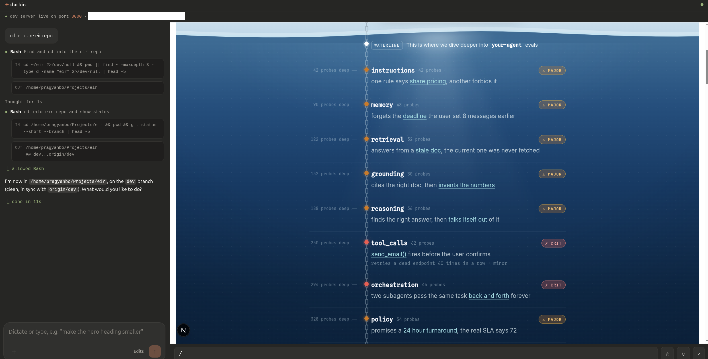

# durbin

**Dictate to Claude Code from your phone and watch your dev server's live preview. One URL, from anywhere.**

*Durbin (दूरबीन) is Nepali for telescope: see and steer your project from far away.*

[](https://pragyansubedi.github.io/durbin/)



Durbin runs on your computer, next to your project. It gives you a single token-gated URL that serves two things:

- **`/__agent`**: a mobile-first page where you type or dictate what Claude Code should do. Claude runs on your machine, in your repo, and its output streams back live. When Claude needs something from you (a permission, a clarifying question), the run pauses and a card appears with buttons to answer. Attach screenshots from your phone (the + menu in the composer) and Claude sees them: mark up a design, circle a bug, screenshot the preview itself. Runs can be stopped mid-flight (■), messages sent while Claude is busy queue up and dispatch in order, replies render as markdown and can be read aloud, and push notifications tell you when Claude finishes or is waiting on an answer, even with the phone locked.
- **everything else**: a reverse proxy to your local dev server, hot reload included. The live preview of your site is the same URL's root, updating as Claude edits your files.

Built for the moments you can't (or don't want to) look at a monitor: resting your eyes, on the couch, in a cafe while your workstation runs at home. Pair it with any voice keyboard (Wispr Flow, iOS dictation, Gboard) and development becomes a conversation with a live preview.

## Durbin vs Claude Code Remote Control

Claude Code's official [Remote Control](https://code.claude.com/docs/en/remote-control) (`/rc`) also lets you drive a local session from your phone. Where they differ:

| | durbin | Remote Control |
| --- | :---: | :---: |
| Claude runs on your machine, in your repo | ✅ | ✅ |
| Live preview of your dev server on the phone, hot reload included | ✅ | ❌ |
| Live preview side by side with the Claude Code session on desktop, tabbed on mobile | ✅ | ❌ |
| Agent and preview share one URL | ✅ | ❌ |
| Works in any browser with just a link, no Claude login on the phone | ✅ | ❌ |
| Always-on: runs as a service, no terminal session to keep alive or re-pair | ✅ | ❌ |
| One-tap dev server restart after a reboot | ✅ | ❌ |
| Open source, self-hosted, you own the transport (your tunnel) | ✅ | ❌ |
| Polished native app experience with push notifications | ❌ | ✅ |
| Official Anthropic support | ❌ | ✅ |

They compose nicely: use Remote Control when you want the native app feel, durbin when you want the preview loop and an always-on URL.

## How it works

```
your phone (any browser)
      |
      |  https  (Tailscale Funnel)
      v
durbin bridge on your computer (port 8787)
      |-- /__agent  ->  Claude Code via the Claude Agent SDK, in your repo
      |-- /*        ->  your dev server (any port; 3000 by default), websockets proxied for HMR
```

- Runs Claude Code through the official [Claude Agent SDK](https://code.claude.com/docs/en/agent-sdk/overview). Consecutive messages resume one session, so Claude keeps context between commands.
- Permission requests, plan approvals, and `AskUserQuestion` prompts surface as interactive cards through the SDK's `canUseTool` callback. Nothing is silently auto-approved beyond what the mode you picked allows.
- Assistant text streams token by token. Polling is stateless, so locking your phone mid-run loses nothing; reopen the page and it reattaches.
- Zero framework lock-in: the proxy works with anything that serves HTTP on a port (Next.js, Vite, Rails, whatever).

## Setup

### Prerequisites (one-time, per machine)

The two things durbin can't do for you:

1. **Node 20+** and a **[Claude Code](https://claude.com/claude-code) login** — durbin runs Claude on your machine, with your existing plan or API key.
2. **[Tailscale](https://tailscale.com/download)**, logged in:

   ```sh
   curl -fsSL https://tailscale.com/install.sh | sh   # or your OS's installer
   sudo tailscale up
   ```

   This is what gives you a stable HTTPS URL from anywhere, for free, with no server to run.

### Install

```sh
npm install -g durbin
```

### Every project after that

```sh
cd your-project
durbin
```

That's it. Durbin starts the bridge, turns on [Tailscale Funnel](https://tailscale.com/kb/1223/funnel) by itself, and prints a **QR code** plus the URL, with the login token already baked in — scan it with your phone's camera and you're in. Nothing to configure, no tunnel commands to remember.

Two first-run cases durbin walks you through if they come up:

- **Funnel not enabled on your tailnet yet** (first time ever): durbin prints Tailscale's enable link. Open it once, restart durbin, and it never comes up again.
- **Tailscale needs sudo** on this machine: durbin prints the one `tailscale set --operator` command to fix that.

Exposing the port some other way instead? Pass `--no-funnel` and put any HTTPS tunnel in front of port 8787.

### On your phone

Scan the printed QR (or open the URL) and bookmark it. The token sets a year-long cookie, so the bookmark works clean afterwards; `/a` is a short alias for `/__agent`.

**Add it to your home screen.** Durbin is an installable web app: after logging in once, use "Add to Home Screen" (iOS Safari: Share button, then Add to Home Screen; Android Chrome: menu, then Add to Home screen). You get a durbin icon that opens fullscreen without any browser chrome, and you never type the URL again.

**Prefer a password over the token?** Set one per project:

```sh
durbin password <your-password>
```

The login page then accepts your password (the token keeps working, so tokened bookmarks survive). It is stored as a scrypt hash in `.durbin/password`, never in plain text. Change it by re-running the command; log every device out by deleting `.durbin/token` and restarting.

### Options

```
durbin --port 8787 --dev-port 3000 --dev-cmd "npm run dev"
```

| Flag | Default | Meaning |
| --- | --- | --- |
| `--port` | `8787` | port the bridge listens on |
| `--dev-port` | `3000` | dev server port to proxy — or just tap the port number on the phone to switch live (Vite's 5173, Rails' 3000, anything); the choice sticks per project |
| `--dev-cmd` | `npm run dev` | command the "Start dev server" action (in the + menu) runs |
| `--claude` | SDK bundled | path to a specific `claude` executable |
| `--no-funnel` | off | skip the automatic Tailscale Funnel setup |

Environment variables `DURBIN_PORT`, `DURBIN_DEV_PORT`, `DURBIN_DEV_CMD`, `DURBIN_CLAUDE_BIN`, and `DURBIN_NO_FUNNEL` work too.

## Modes

The mode button in the composer (Claude Code style — "⚡ Auto" and friends) maps onto Claude Code's permission modes and applies per message, so you can plan one task and auto-run the next in the same conversation:

- **Manual**: every tool call — file edits included — pauses the run and asks on your phone.
- **Plan**: Claude reads and explores but doesn't touch anything; it proposes a plan that arrives as a card. "Build it" approves the plan and switches the session to Edits mode; "Keep planning" (optionally with feedback you type or dictate) sends it back to the drawing board.
- **Edits** (default): file edits are auto-approved so work flows, but shell commands, web fetches, and anything else not covered by your repo's Claude permission rules ask you first.
- **Auto**: everything runs without asking — builds, git, installs, the lot.

Claude's clarifying questions come to you in every mode, including Auto. Unanswered prompts auto-deny after 15 minutes. Your last-used mode is remembered per device.

## Model & thinking

"Model & thinking" in the + menu opens settings that persist per project (in `.durbin/state.json`) and apply to the live session immediately — no restart, the conversation keeps its context:

- **Model**: pick any model your Claude Code login offers (the list comes from Claude itself; first open boots it briefly to ask), or stay on the default.
- **Thinking effort**: default / low / medium / high / xhigh / max, filtered to what the selected model supports.
- **Extended thinking**: switch Claude's thinking phase off entirely for snappier simple tasks, back on for hard ones.

## Security notes

Read this part.

- Anyone with your token or password can drive an AI agent that edits files in that project, and in Auto mode run shell commands on your machine. Treat them like any other credential, and pick a strong password if you set one. Rotate access any time by deleting `.durbin/token` and restarting.
- All traffic rides HTTPS through your tunnel; the bridge itself only listens on `127.0.0.1`. The auth cookie is HttpOnly.
- Everything durbin stores (token, session state, run transcripts) lives in `.durbin/` inside your project, which durbin adds to `.git/info/exclude` automatically so it never lands in your repo.
- Tailscale Funnel gives you a stable hostname with TLS tied to your tailnet identity, and you can turn public exposure off with one command (`tailscale funnel --https=443 off`).

## Run it as a service (optional)

On Linux the bundled one-shot script does everything: installs a systemd user
service for the project you run it from, enables Tailscale Funnel, and prints
your phone URL:

```sh
cd your-project
bash /path/to/durbin/setup.sh
```

Or by hand, a systemd user unit works well:

```ini
# ~/.config/systemd/user/durbin.service
[Unit]
Description=durbin bridge
After=network.target

[Service]
WorkingDirectory=/path/to/your-project
ExecStart=/usr/bin/env durbin
Restart=on-failure

[Install]
WantedBy=default.target
```

```sh
systemctl --user enable --now durbin
loginctl enable-linger $USER   # keep it running while logged out
```

`tailscale funnel --bg` persists on its own.

## FAQ

**Does my phone need an app or Tailscale?** No. Any browser works; the tunnel does the networking.

**What if the dev server is down (say, after a reboot)?** The header dot goes red and the preview shows a friendly error page. Tap "Start dev server" in the + menu on the phone.

**Is each message a fresh Claude session?** No, messages continue one session so context carries over. "New session" archives the current conversation and starts a clean one, and "Switch session" (both in the + menu) lets you move between sessions (each keeps its own Claude context and scrollback) or delete old ones.

## License

MIT
